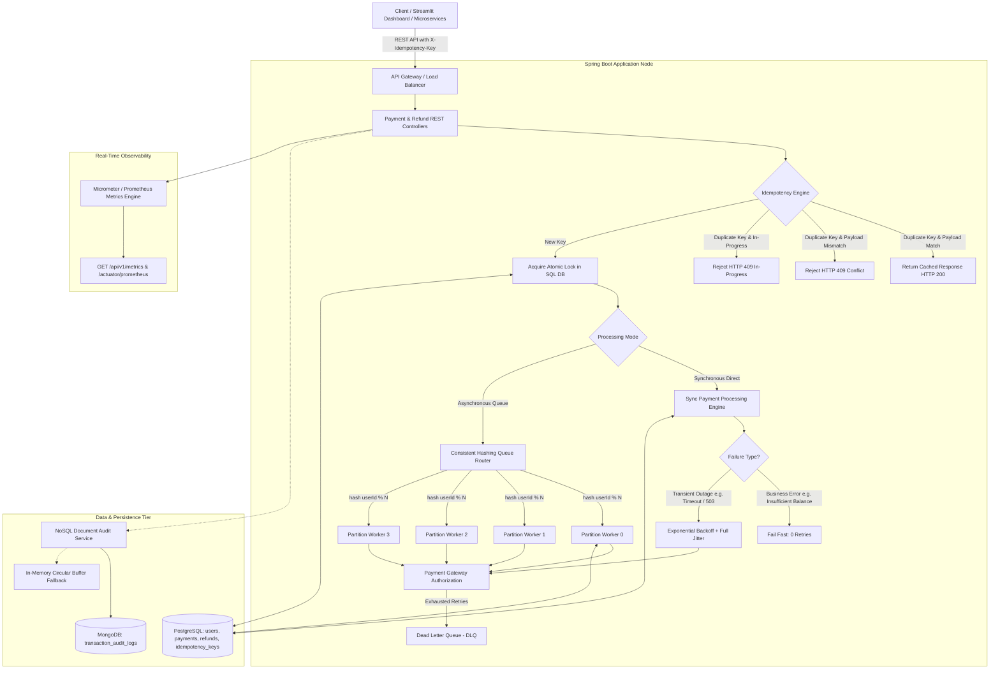

# ⚡ Distributed Fault-Tolerant Payment & Transaction Engine

[](https://github.com/Dhanya562004/distributed-fault-tolerant-payment-system)
[](https://www.oracle.com/java/)
[](https://spring.io/projects/spring-boot)
[](https://distributed-fault-tolerant-payment-system-5qg2tjnkfrk7tvbqxzsz.streamlit.app/)
[](docs/testing.md)
[](LICENSE)

An enterprise-grade, distributed, fault-tolerant **Payment & Transaction Engine** engineered with **Java 17 and Spring Boot 3.3**, modeled after high-throughput transaction processing systems at **Standard Chartered Bank**, Stripe, and PayPal. Designed for single-execution idempotency guarantees, fail-fast business error classification, exponential backoff retries with jitter, account-partitioned asynchronous worker queues, and polyglot persistence (PostgreSQL + MongoDB).

---

### 🌐 Live Interactive Cloud Control Room
👉 **[Launch Live Visual Control Room Dashboard](https://distributed-fault-tolerant-payment-system-5qg2tjnkfrk7tvbqxzsz.streamlit.app/)**  
*Hosted on Streamlit Community Cloud with Hybrid Processing Engine (supports live Spring Boot API and standalone cloud visual simulation).*

---

## 📑 Engineering Documentation Suite

| Document | Purpose |
| :--- | :--- |
| 📊 **[Requirements Traceability Matrix](docs/requirements-matrix.md)** | Direct mapping to Standard Chartered Bank Development Engineer (Band 8) requirements (100% verified coverage). |
| 🏛️ **[System Architecture](docs/architecture.md)** | Deep-dive into distributed topology, concurrency models, partitioned queues, and retry loops. |
| ⚖️ **[Architectural Decision Records (ADRs)](docs/design-decisions.md)** | Rationale for SHA-256 payload digests, fail-fast error classification, and polyglot storage. |
| 🔌 **[REST API Guide](docs/api-guide.md)** | Complete HTTP endpoints, OpenAPI 3.0 schemas, headers, pagination, and error responses. |
| 🧪 **[Test Strategy & Verification](docs/testing.md)** | Verification evidence for 20 automated tests, concurrency stress test, and retry resilience. |
| 🎯 **[Technical Interview Preparation](docs/interview-preparation.md)** | 14 rigorous interview questions and concise code-backed architectural explanations. |
| 📝 **[Initial Codebase Audit](docs/initial-audit.md)** | Forensic analysis of baseline code, identified edge cases, and upgrade roadmap. |
| 📜 **[Development Log](docs/dev-log.md)** | Chronological log of changes, refactorings, and verification commands. |
| ✅ **[Final Verification Report](docs/final-verification.md)** | Exact build commands, execution times, test counts, and artifact confirmation. |

---

## 🏛️ System Architecture



---

## ⚙️ Core Engineering Capabilities

### 1. 🛡️ Absolute Idempotency & Payload Conflict Detection
- **Atomic Locks**: Evaluates `X-Idempotency-Key` using database-level `UNIQUE` constraints in PostgreSQL.
- **SHA-256 Digest Verification**: Prevents key hijacking. If an idempotency key is reused with a different request payload, the engine rejects it immediately with `PayloadMismatchException` (HTTP 409 Conflict).
- **Concurrent In-Flight Protection**: Rejects concurrent requests using the same key with `DuplicateRequestException` (HTTP 409 Conflict).

### 2. 🔁 Intelligent Failure Taxonomy & Exponential Backoff
- **Fail-Fast Business Errors**: Non-retryable errors (`InsufficientBalanceException`, `PayloadMismatchException`, `InvalidTransactionStateException`) fail fast on Attempt 1 without wasting retries (`retryCount = 0`).
- **Resilient Retry Loop**: Transient failures (`GatewayTimeoutException`, `ServiceUnavailableException`, `LockAcquisitionException`) are retried up to 3 times with exponential backoff and randomized jitter:
  $$\text{Backoff} = \min\left(\text{Initial} \times 2^{\text{attempt}} + \text{rand}(0, 200\text{ms}), 8000\text{ms}\right)$$

### 3. 🔀 Account-Partitioned Asynchronous Worker Pools
- Uses consistent hashing on `userId` to route asynchronous payment requests to dedicated partition queues.
- Guarantees **strict per-user FIFO execution order** while allowing parallel multi-threaded throughput across distinct customer accounts.

### 4. 💸 Cumulative Refund Ceiling Validation
- Enforces multi-step refund limits:
  $$\sum \text{Existing Refunds} + \text{New Refund Amount} \le \text{Original Payment Amount}$$
- Prevents over-refunding and transitions payment status to `REFUNDED` upon full repayment.

### 5. 📜 Polyglot Persistence Strategy
- **PostgreSQL / H2**: Relational ACID transactional storage with `@Version` optimistic locking, row constraints, foreign keys, and indexes.
- **MongoDB**: High-throughput, append-only document audit log (`AuditLogDocument`) with in-memory non-blocking circular fallback queue.

---

## 🔌 REST API Specification

| HTTP Method | Endpoint | Parameters / Headers | Description |
| :--- | :--- | :--- | :--- |
| `POST` | `/api/v1/payments` | `X-Idempotency-Key` | Initiate synchronous or asynchronous payment transaction |
| `GET` | `/api/v1/payments/{paymentId}` | `paymentId` (Path) | Query payment status and details |
| `GET` | `/api/v1/payments` | `page`, `size` (Query) | List payment records with pagination |
| `GET` | `/api/v1/payments/user/{userId}` | `userId` (Path), `page`, `size` | List user payment records with pagination |
| `POST` | `/api/v1/refunds` | `X-Idempotency-Key` | Process refund and restore user account balance |
| `GET` | `/api/v1/refunds/{refundId}` | `refundId` (Path) | Query refund record details |
| `GET` | `/api/v1/refunds/payment/{paymentId}` | `paymentId` (Path) | Query all refunds for a specific payment |
| `POST` | `/api/v1/users` | JSON Payload | Register a new user account with starting balance |
| `GET` | `/api/v1/users/{userId}` | `userId` (Path) | Retrieve user balance and account details |
| `GET` | `/api/v1/audit/logs` | None | Query immutable document state transition audit trail |
| `GET` | `/api/v1/metrics` | None | Real-time Prometheus/Micrometer throughput, retries & latency |
| `POST` | `/api/v1/simulation/config` | JSON Payload | Inject simulated latency, socket timeouts, 503 gateway errors |
| `POST` | `/api/v1/simulation/reset` | None | Reset fault simulation lab to clean defaults |

---

## 🧪 Automated Testing & Concurrency Evidence

The test suite validates correctness under heavy contention and edge cases:

- **20 Automated Tests Executed**: 20 Passed, 0 Failures, 0 Errors.
- **Multi-Threaded Stress Test (`ConcurrentPaymentTest`)**: 10 parallel threads contending for the same idempotency key simultaneously:
  - **Result**: Exactly 1 thread successfully acquired the atomic lock and processed the transaction.
  - **Result**: 9 threads encountered managed lock conflicts and were gracefully rejected without side effects.
  - **Result**: User balance deducted **exactly once** ($1,000 -> $900). Zero double-spending.
- **Fail-Fast Verification (`PaymentProcessingServiceTest`)**: Insufficient account balance fails on Attempt 1 with 0 retries.
- **Payload Conflict Verification (`IdempotencyServiceTest`)**: Same key with different payload triggers HTTP 409 Conflict.
- **Cumulative Refund Limits (`RefundProcessingServiceTest`)**: Multiple refunds totaling more than transaction amount rejected with HTTP 422.
- **End-to-End Lifecycle (`PaymentLifecycleIntegrationTest`)**: Full lifecycle verified in Spring Boot test container.

```bash
mvn clean test
```

---

## 🚀 Quick Start Guide

### Prerequisites
- **JDK 17+**
- **Apache Maven 3.9+**
- **Docker & Docker Compose** (Optional for containerized run)
- **Python 3.10+** (For Streamlit control room dashboard)

### 1. Run Backend Locally with Maven
```bash
# Clone the repository
git clone https://github.com/Dhanya562004/distributed-fault-tolerant-payment-system.git
cd distributed-fault-tolerant-payment-system

# Run tests
mvn clean test

# Run application locally
mvn spring-boot:run
```
> API available at `http://localhost:8080`  
> OpenAPI Swagger UI available at `http://localhost:8080/swagger-ui.html`

### 2. Run Dashboard Locally with Python
```bash
cd dashboard
pip install -r requirements.txt
streamlit run app.py
```
> Access Streamlit UI at `http://localhost:8501`

### 3. Multi-Container Docker Deployment
```bash
docker-compose up --build
```
Orchestrates:
- **Backend API**: `http://localhost:8080`
- **PostgreSQL**: `localhost:5432`
- **MongoDB**: `localhost:27017`
- **Streamlit Dashboard**: `http://localhost:8501`

---

## 🤝 License
Distributed under the **Apache 2.0 License**. Reference implementation for distributed transaction processing.
