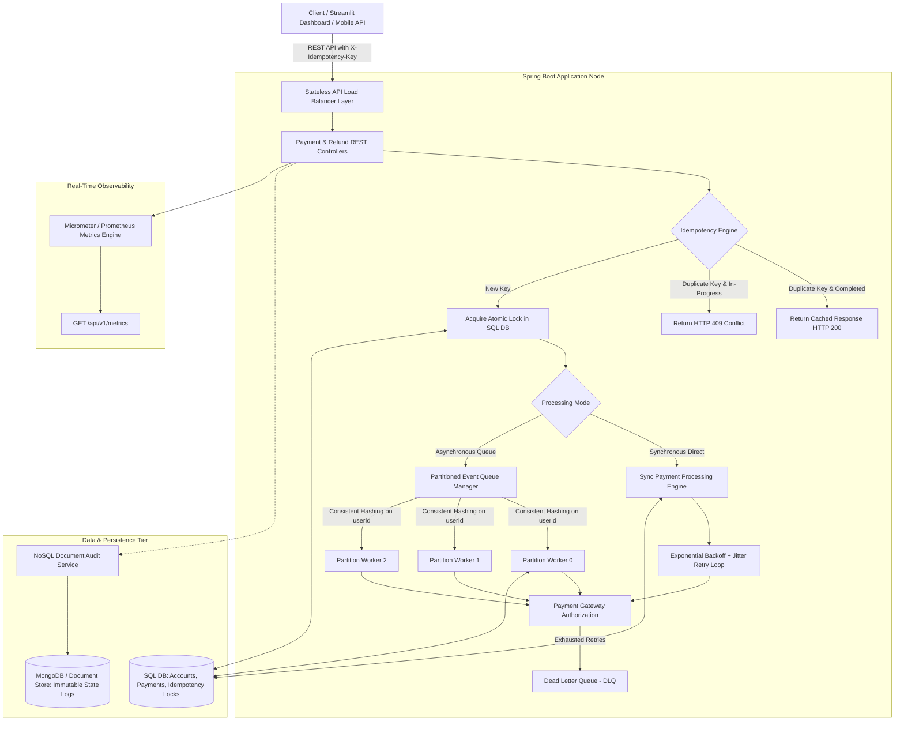

# ⚡ Distributed Fault-Tolerant Payment & Transaction Processing System

[](https://github.com/Dhanya562004/distributed-fault-tolerant-payment-system)
[](https://www.oracle.com/java/)
[](https://spring.io/projects/spring-boot)
[](https://distributed-fault-tolerant-payment-system-5qg2tjnkfrk7tvbqxzsz.streamlit.app/)
[](LICENSE)

A production-grade, highly available, and horizontally scalable **Distributed Fault-Tolerant Payment & Transaction Engine** built with **Java 17 + Spring Boot 3.3**. Engineered to handle high-throughput distributed transaction processing with single-execution idempotency guarantees, partitioned async worker pools, hybrid persistence, and resilient retry mechanisms (similar to backend architecture at Stripe and PayPal).

---

### 🌐 Live Interactive Cloud Dashboard
👉 **[Launch Live Visual Control Room Dashboard](https://distributed-fault-tolerant-payment-system-5qg2tjnkfrk7tvbqxzsz.streamlit.app/)**  
*Hosted on Streamlit Community Cloud with Hybrid Processing Engine (supports live Spring Boot API and standalone cloud visual simulation).*

---

## 🏛️ System Architecture & Design Overview

The engine operates on a **stateless API layer, partitioned async queue messaging, decoupled worker pools, atomic idempotency guards, and hybrid SQL + NoSQL persistence**.



---

## ⚙️ Core Engineering Pillars

### 1. 🛡️ Absolute Idempotency Engine (`IdempotencyService`)
- Enforces strict single-execution guarantees across distributed retry storms.
- Uses MD5/SHA-256 request payload digests stored atomically in the SQL database (`idempotency_keys` table).
- Serves cached HTTP response payloads on duplicate retries and raises `409 Conflict` during concurrent processing windows.

### 2. 🔀 Partitioned Message Queue & Scalable Worker Pool (`DistributedQueueManager`)
- Implements consistent hashing partition routing based on `userId` / `partitionKey`.
- Guarantees **strict FIFO per-user transaction ordering** while allowing horizontal scaling of worker threads across independent partitions.
- Dead Letter Queue (`DLQ`) isolates unrecoverable messages after max retry attempts.

### 3. 🔁 Fault Tolerance, Retries & Jitter (`GatewaySimulationService`)
- Implements exponential backoff (`backoff = initial * 2^attempt + jitter`) to mitigate downstream thundering herd problems.
- Built-in simulation lab dynamically injects network latency, socket timeouts, 503 gateway outages, and database connection lock conflicts.

### 4. 🔐 Concurrency Controls & ACID Compliance
- Combines **Optimistic Locking (`@Version`)** and **Pessimistic Row Locking (`SELECT FOR UPDATE`)** on user balance updates to eliminate double-spending under heavy multi-threaded contention.
- Atomic Spring `@Transactional(isolation = Isolation.READ_COMMITTED)` boundaries ensure full data integrity.

### 5. 📜 Dual Relational (SQL) & Document (NoSQL) Persistence
- **SQL (PostgreSQL / H2)**: Structured storage for user balances, transaction records, and idempotency lock entries.
- **NoSQL (MongoDB / In-Memory Store)**: Append-only, immutable document audit logs (`transaction_logs`) tracking full state lifecycle transitions (`PENDING -> PROCESSING -> SUCCESS / FAILED`).

### 6. ⚡ Hybrid Visual Control Room Engine (`app.py`)
- Automatically probes for a live Spring Boot backend on `http://localhost:8080`.
- Includes a standalone in-memory fallback engine for cloud deployments (such as Streamlit Community Cloud) so interactive simulations work 100% reliably anywhere without external dependencies.

---

## 🔌 REST API Specification

| HTTP Method | Endpoint | Headers / Parameters | Description |
| :--- | :--- | :--- | :--- |
| `POST` | `/api/v1/payments` | `X-Idempotency-Key` (Optional) | Initiate payment transaction with idempotency enforcement |
| `GET` | `/api/v1/payments/{paymentId}` | `paymentId` (Path) | Fetch detailed payment transaction status |
| `GET` | `/api/v1/payments` | None | List recent historical payment records |
| `GET` | `/api/v1/payments/user/{userId}` | `userId` (Path) | List all payment transactions for a specific user |
| `POST` | `/api/v1/refunds` | `X-Idempotency-Key` (Optional) | Process refund and restore account balance |
| `GET` | `/api/v1/audit/logs` | None | Query NoSQL state transition audit trail |
| `GET` | `/api/v1/metrics` | None | Real-time throughput, latency, retry counts, and DLQ metrics |
| `POST` | `/api/v1/simulation/config` | JSON Payload | Dynamically inject latency, timeouts, or 503 gateway outages |
| `POST` | `/api/v1/simulation/reset` | None | Reset fault injection rules to clean default state |

---

## 📊 Streamlit Visual Control Room Dashboard

Consumes backend REST APIs in real-time or runs in standalone cloud mode:

- 📊 **Live Activity Feed**: Real-time payment feed with status badges (`SUCCESS`, `FAILED`, `PENDING`, `REFUNDED`).
- 💳 **Interactive Payment Terminal**: Submit synchronous payments, async worker queue jobs, or refunds.
- 📈 **Performance Analytics**: Plotly metrics charts, success rate gauges, and latency monitoring.
- 📜 **NoSQL Audit Inspector**: Timeline inspector tracking state transitions with worker thread signatures.
- 🛡️ **Fault Injection Lab**: Dynamically toggle simulated network latency, timeouts, and 503 gateway outages.

---

## 🚀 Quick Start Guide

### Prerequisites
- **JDK 17+** (or JDK 21 / 24)
- **Apache Maven 3.9+**
- **Python 3.10+** (For Streamlit dashboard)
- **Docker & Docker Compose** (Optional for containerized deployment)

### 1. Run Backend locally with Maven
```bash
# Clone the repository
git clone https://github.com/Dhanya562004/distributed-fault-tolerant-payment-system.git
cd distributed-fault-tolerant-payment-system

# Build and start Spring Boot backend
mvn clean spring-boot:run
```
> The REST API server will start on `http://localhost:8080`.  
> OpenAPI Swagger documentation is available at `http://localhost:8080/swagger-ui.html`.

### 2. Run Dashboard locally with Python
```bash
# In a new terminal window
cd dashboard
pip install -r requirements.txt
streamlit run app.py
```
> Access the Streamlit dashboard at `http://localhost:8501`.

### 3. Multi-Container Docker Deployment
```bash
docker-compose up --build
```
This orchestrates:
- **Spring Boot API Server**: `http://localhost:8080`
- **PostgreSQL Database**: `localhost:5432`
- **MongoDB Audit Database**: `localhost:27017`
- **Streamlit Control Room Dashboard**: `http://localhost:8501`

---

## 🧪 Automated Testing & Stress Validation

The test suite validates reliability under extreme load:
- `IdempotencyServiceTest`: Tests idempotency lock acquisition, duplicate detection, and cached response delivery.
- `PaymentProcessingServiceTest`: Tests transaction state transitions and balance checks.
- `FaultToleranceRetryTest`: Validates exponential backoff recovery during transient gateway socket outages.
- `ConcurrentPaymentTest`: Multi-threaded stress test (**10 parallel threads**) verifying **zero double-charging** and single execution under heavy contention.

```bash
mvn clean test
```

---

## 🤝 Author & License

Developed with ❤️ as an enterprise-grade Distributed Systems & Payment Processing reference architecture.  
Distributed under the **Apache 2.0 License**.
