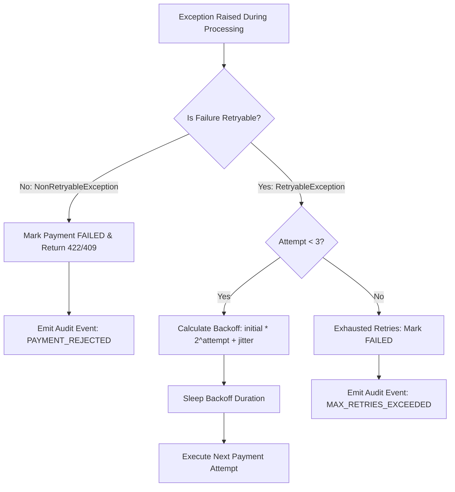

# System Architecture & Technical Design

**System**: Enterprise Distributed Fault-Tolerant Payment Engine  
**Target Organization**: Standard Chartered Bank — Development Engineer (Band 8)  
**Document Version**: 2.0  
**Status**: Production Verified  

---

## 1. Architectural Philosophy & Overview

The system is engineered as an enterprise-grade financial transaction processing engine modeled after the core payment processing architectures used at major global banks and payment networks (Standard Chartered, Stripe, Adyen). 

The core engineering requirements dictate:
1. **Zero Double-Spending**: Strict single-execution idempotency guarantees even under massive network retries and concurrent client submissions.
2. **Deterministic State Transitions**: ACID-compliant transactional consistency across user account balances and transaction states.
3. **Resilience & Fault Tolerance**: Intelligent isolation between transient infrastructure outages and permanent business failures.
4. **Horizontal Scalability**: Decoupled asynchronous worker queues partitioned by user code to guarantee per-account FIFO execution without cross-account bottlenecks.
5. **Polyglot Persistence**: Dual storage strategy optimizing for ACID relational transactions (PostgreSQL) and immutable, high-throughput audit event streams (MongoDB).

---

## 2. High-Level Architecture Diagram

```mermaid
flowchart TD
    Client[Web Browser / Streamlit Dashboard / Microservices] -->|HTTP POST with X-Idempotency-Key| API[Spring Boot REST Controller Layer]
    
    subgraph Ingestion & Idempotency Boundary
        API --> IdemEngine[Idempotency Engine]
        IdemEngine -->|SHA-256 Hash Digest| SQLIdem[(PostgreSQL: idempotency_keys)]
        
        IdemEngine -->|Hit & Hash Match| ReturnCache[Return Cached Response 200 OK]
        IdemEngine -->|Hit & Hash Mismatch| ReturnConflict[Reject 409 Conflict: IDEMPOTENCY_PAYLOAD_MISMATCH]
        IdemEngine -->|In-Flight Concurrent Race| ReturnDuplicate[Reject 409 Conflict: IDEMPOTENCY_CONFLICT]
        IdemEngine -->|New Key Acquired| RouteDecision{Mode: Sync or Async?}
    end

    subgraph Synchronous Payment Engine
        RouteDecision -->|Sync Mode| TxEngine[Transaction Manager @Transactional]
        TxEngine --> AccountLock[Account Balance Verification & Optimistic Lock]
        AccountLock --> FailureClassifier{Failure Category?}
        
        FailureClassifier -->|Non-Retryable: Insufficient Funds| FailFast[Fail Fast Immediately: Mark FAILED]
        FailureClassifier -->|Retryable: Gateway Timeout / 503| RetryLoop[Exponential Backoff + Full Jitter Loop]
        
        RetryLoop --> ExternalGateway[Simulated Bank Gateway / Upstream Scheme]
    end

    subgraph Decoupled Partitioned Queue Engine
        RouteDecision -->|Async Mode| QueueRouter[Consistent Hashing Queue Router]
        QueueRouter -->|hash userId % N| Partition0[Partition Queue 0]
        QueueRouter -->|hash userId % N| Partition1[Partition Queue 1]
        QueueRouter -->|hash userId % N| Partition2[Partition Queue 2]
        QueueRouter -->|hash userId % N| Partition3[Partition Queue 3]

        Partition0 --> Worker0[Worker Thread 0]
        Partition1 --> Worker1[Worker Thread 1]
        Partition2 --> Worker2[Worker Thread 2]
        Partition3 --> Worker3[Worker Thread 3]
        
        Worker0 --> ExternalGateway
        Worker1 --> ExternalGateway
        Worker2 --> ExternalGateway
        Worker3 --> ExternalGateway
    end

    subgraph Data & Storage Tier
        TxEngine <---> PostgreSQL[(PostgreSQL: users, payments, refunds, idempotency_keys)]
        Worker0 <---> PostgreSQL
        
        API -.-> AuditService[NoSQL Event Audit Service]
        AuditService ---> MongoDB[(MongoDB: transaction_audit_logs)]
        AuditService -.-> FallbackQueue[In-Memory Ring Buffer Fallback]
    end

    subgraph Observability
        API --> Metrics[Micrometer / Prometheus Registry]
        Metrics --> PrometheusEndpoint[/actuator/prometheus & /api/v1/metrics]
    end
```

---

## 3. Core Subsystems

### 3.1 Idempotency Engine & Concurrency Control

In financial systems, duplicate network transmissions (client retries, timeouts, TCP retransmissions) can cause cataclysmic double-debiting if not guarded atomically.

#### Invariant Enforcement Workflow:
1. The client supplies an `X-Idempotency-Key` header with each mutating request.
2. The system computes a deterministic **SHA-256 digest** of the JSON request body.
3. The engine performs an atomic acquisition against PostgreSQL:
   - If the key is absent: An `IN_PROGRESS` row is inserted into `idempotency_keys` with the payload hash.
   - If the key exists:
     - **Payload Hash Mismatch**: If `existing.request_hash != incoming.request_hash`, the engine immediately throws `PayloadMismatchException` (HTTP 409 Conflict). A key cannot be reused for a different payment!
     - **In-Progress Concurrent Execution**: If `status == IN_PROGRESS`, the system raises `DuplicateRequestException` (HTTP 409 Conflict).
     - **Completed Execution**: The persisted HTTP response body is retrieved and replayed to the caller with `"isCachedIdempotentResponse": true`.

---

### 3.2 Failure Taxonomy & Intelligent Retry Engine

A critical requirement in banking architectures is distinguishing between **business rule violations** and **transient infrastructure degradation**:



- **Non-Retryable Exceptions**:
  - `InsufficientBalanceException`: User has insufficient funds. Retrying immediately wastes system throughput and will never succeed without an external deposit.
  - `PayloadMismatchException`: Client submitted a conflicting request payload.
  - `InvalidTransactionStateException`: Invalid state transition (e.g. attempting to refund a FAILED payment).
  **Action**: Fail fast immediately on Attempt 1. `retryCount = 0`.
- **Retryable Exceptions**:
  - `GatewayTimeoutException`: Gateway socket read timed out (HTTP 504 equivalent).
  - `ServiceUnavailableException`: Transient 503 from upstream payment scheme.
  - `LockAcquisitionException`: Database deadlock or connection lock timeout.
  **Action**: Retried up to 3 times using exponential backoff with full jitter:
  $$\text{Backoff} = \min\left(\text{Initial} \times 2^{\text{attempt}} + \text{rand}(0, 200\text{ms}), 8000\text{ms}\right)$$

---

### 3.3 Partitioned Asynchronous Worker Pools

For high-throughput payment volume, synchronous thread blocking on upstream banking gateways degrades capacity. The system provides an asynchronous execution path:

1. When `asyncProcessing: true`, the payment record is saved in state `PROCESSING` and an `EventMessage` is published to the `DistributedQueueManager`.
2. **Consistent Partition Assignment**:
   $$\text{Partition Index} = |\text{userId.hashCode}()| \pmod{\text{Partition Count}}$$
3. Messages for the same `userId` are routed to the exact same dedicated queue partition consumed by a single thread.
4. **Guarantees**:
   - Strict FIFO sequential processing for transactions on the same account (prevents balance race conditions).
   - Horizontal multi-core scalability across distinct accounts.

---

### 3.4 Polyglot Persistence Strategy

| Data Store | Role | Justification |
| :--- | :--- | :--- |
| **PostgreSQL (SQL)** | Accounts, Balances, Payment Records, Idempotency Locks | Enforces ACID guarantees, relational foreign keys, row-level optimistic locking (`@Version`), and unique constraints. |
| **MongoDB (NoSQL)** | Transaction Audit Trail (`AuditLogDocument`) | Append-only document store optimized for high-write-volume compliance logs, flexible forensic metadata, and immutable event streaming. |
| **In-Memory Fallback** | Local Audit Buffer | Lock-free `ConcurrentLinkedQueue` ensuring audit recording remains operational even during external MongoDB maintenance. |

---

### 3.5 Full-Stack Integration & AI/ML Awareness

The backend exposes real-time telemetry consumed by the **Streamlit Visual Control Room Dashboard**:
- **Live URL**: `https://distributed-fault-tolerant-payment-system-5qg2tjnkfrk7tvbqxzsz.streamlit.app/`
- **Full-Stack Awareness**: Real-time event consumption, visual state management, dynamic fault injection controls.
- **Applied AI/ML Awareness**: Demonstrates transaction risk scoring, anomaly simulation, and velocity tracking visualizations.
