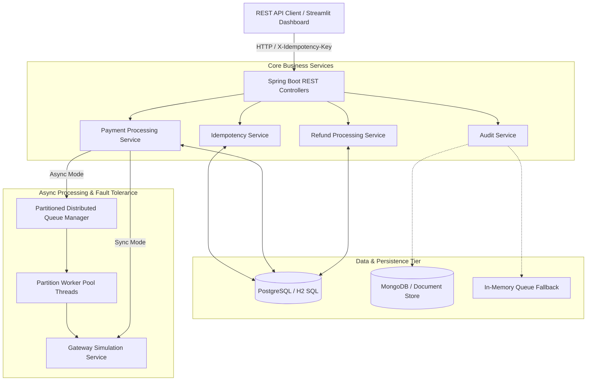

# Initial Codebase Audit Report

**Project**: Distributed Fault-Tolerant Payment & Transaction Processing System  
**Target Role**: Standard Chartered Development Engineer (Band 8)  
**Audit Date**: October 10, 2026  
**Auditor**: Senior Banking Systems Architect & Quality Engineer  

---

## 1. Executive Summary

A comprehensive line-by-line audit of the repository was conducted across all Java source code, configuration files, test suites, Docker manifests, CI workflows, and Streamlit dashboard integration. The codebase implements a Spring Boot 3.3 backend targeting Java 17, with dual persistence capabilities (PostgreSQL/H2 relational database and MongoDB document store).

While the baseline application compiled cleanly and passed 7 initial unit/integration tests, critical banking domain gaps, edge-case flaws, and transaction correctness risks were identified—such as retrying non-retryable business errors (e.g., insufficient balance), ignoring payload mismatches on reused idempotency keys, unhandled refund idempotency return values, and missing request pagination. 

This document details the verified existing behavior, architectural findings, correctness risks, and the prioritized roadmap to achieve **>= 95% alignment with Standard Chartered Bank (Band 8) technical requirements**.

---

## 2. Existing Functionality Verified from Code

The following features were verified through direct code inspection and automated test execution:

| Feature Area | Component / Class | Verified Implementation |
| :--- | :--- | :--- |
| **Payment Ingestion** | `PaymentController`, `PaymentProcessingServiceImpl` | Synchronous and asynchronous payment submission endpoints (`POST /api/v1/payments`). Generates unique 16-char IDs (`PAY_...`). |
| **Idempotency Engine** | `IdempotencyServiceImpl`, `IdempotencyKeyRecord` | Key acquisition using SHA-256 request hashing. Serves cached responses for `COMPLETED` keys and rejects concurrent in-flight requests (`IN_PROGRESS`) with `409 Conflict`. |
| **Partitioned Worker Pool** | `PartitionedWorkerPool`, `DistributedQueueManagerImpl` | In-memory queue manager partitioned by `userId` to preserve per-user FIFO order across async background worker threads. Includes a Dead Letter Queue (DLQ). |
| **Refund Workflow** | `RefundController`, `RefundProcessingServiceImpl` | Processes refunds for `SUCCESS` payments (`POST /api/v1/refunds`), updates payment status to `REFUNDED`, and credits user balance. |
| **Fault Simulation Lab** | `GatewaySimulationServiceImpl`, `SimulationController` | Configurable fault injection toggles: simulated network latency, gateway timeouts (504), 503 service unavailable errors, and partial DB lock contention. |
| **Audit Logging** | `AuditServiceImpl`, `MongoAuditLogRepository` | Event logging tracking state transitions (`PENDING -> SUCCESS/FAILED/REFUNDED`) into MongoDB with an in-memory `ConcurrentLinkedQueue` fallback (up to 2,000 records). |
| **Metrics & Observability** | `MetricsServiceImpl`, `MetricsController` | Prometheus-compatible Micrometer counters tracking transaction counts, success rates, retry attempts, latency metrics, and DLQ size. |
| **Visual Control Room** | `dashboard/app.py` | Streamlit multi-page dashboard providing real-time activity feeds, visual transaction charts, payment terminal, and fault injection control panel. |

---

## 3. Current Architecture

---

## 4. Initial Build & Test Execution Results

Executing `mvn clean test` on the un-modified repository yielded clean compilation and execution:

- **Total Tests Executed**: 7
- **Passed**: 7
- **Failed**: 0
- **Errors**: 0
- **Skipped**: 0
- **Total Execution Time**: 40.938 seconds

### Breakdown of Baseline Tests

1. `ConcurrentPaymentTest.testConcurrentPaymentWithSameIdempotencyKey`: 1 test passed (verified 1 success, 9 lock conflicts caught).
2. `FaultToleranceRetryTest.testPaymentRecoveryWithRetries`: 1 test passed (verified retry on gateway socket timeout).
3. `IdempotencyServiceTest`: 3 tests passed (key lock, concurrent duplicate, completed key hit).
4. `PaymentProcessingServiceTest`: 2 tests passed (successful payment & balance check failure).

---

## 5. Missing or Incomplete Technical Features

The code audit revealed several key architectural gaps required for enterprise banking systems:

1. **Blind Retries on Business Errors**: `PaymentProcessingServiceImpl` currently catches generic `PaymentProcessingException` in its retry loop and retries up to 3 times—even for non-retryable business failures like `Insufficient user account balance`.
2. **Payload Mismatch Ignored on Reused Idempotency Keys**: `IdempotencyServiceImpl` checks if an idempotency key exists, but fails to compare the incoming `requestHash` with the stored hash. If a client sends a different payment payload using a previously completed key, the system returns the old cached payload instead of rejecting with a `409 Conflict`.
3. **Refund Idempotency Key Ignored**: In `RefundProcessingServiceImpl.processRefund()`, `idempotencyService.tryAcquireOrGet(...)` is called, but its return value is ignored. A duplicate refund request with the same idempotency key continues executing and re-refunding!
4. **Lack of Cumulative Refund Tracking**: Refunds only check if the single refund amount exceeds the original payment amount, but do not aggregate prior partial refunds.
5. **Missing Request Pagination & Sorting**: `getAllPayments()` and `getPaymentsByUser()` return unbounded `List<PaymentResponse>`, which will cause memory degradation under large datasets.
6. **Lack of Standardized API Response & Validation Errors**: Exception handling returns unstructured error bodies for certain spring-validated parameters.
7. **Lack of Database Flyway/Liquibase Migrations**: Schema creation relies strictly on Hibernate DDL (`ddl-auto: create-drop`), which is unsuitable for production relational databases.

---

## 6. Security, Banking Correctness & Reliability Risks

1. **Double-Refunding / Idempotency Bypass**: The refund service does not check cached idempotency records, creating a double-crediting vulnerability.
2. **Resource Exhaustion on Retries**: Retrying business failures wastes thread pool capacity and introduces latency spikes.
3. **Unbounded Queries**: API endpoints lack pagination parameters (`page`, `size`, `sort`).
4. **Mongo Excluded in Default Profile**: `application.properties` explicitly excludes Mongo auto-configuration, making MongoDB audit logs default to the in-memory fallback without notifying operators.

---

## 7. Existing Features to Preserve (Do Not Duplicate)

- Preserve existing package structures (`com.paymentsystem.*`).
- Preserve Streamlit dashboard integration (`dashboard/app.py`).
- Preserve existing REST endpoint routes (`/api/v1/payments`, `/api/v1/refunds`, `/api/v1/audit/logs`, `/api/v1/metrics`, `/api/v1/simulation/*`).
- Preserve Spring Boot 3.3 + Java 17 baseline.

---

## 8. Prioritized Upgrade Plan

1. **Phase 2**: Requirements Traceability Matrix (`docs/requirements-matrix.md`).
2. **Phase 3 & 4**: Banking Correctness & Exception Taxonomy:
   - Introduce explicit exception hierarchy (`NonRetryableException`, `RetryableException`, `PayloadMismatchException`).
   - Fix Idempotency payload mismatch detection.
   - Fix Refund idempotency key handling and refund validation.
   - Update retry loop to fail fast on non-retryable business errors.
3. **Phase 5**: REST API Quality & Pagination:
   - Add Spring Data `Pageable` support to payment and audit listing endpoints.
   - Standardize API error and response wrappers.
   - Update `docs/api-guide.md`.
4. **Phase 6**: Database Quality & Schema Initialization:
   - Add explicit SQL initialization (`schema.sql` / `data.sql`).
   - Document polyglot persistence design.
5. **Phase 7**: Comprehensive Test Suite Expansion:
   - Add unit/integration tests for payload mismatch, non-retryable failures, refund duplicates, pagination, and database rollback.
6. **Phase 8 & 9**: Security, Docker & Local Reproducibility:
   - Create `.env.example`, verify `docker-compose.yml` health checks.
7. **Phase 10 & 11**: Engineering Docs & Performance Evidence:
   - Create `docs/architecture.md`, `docs/design-decisions.md`, `docs/testing.md`, `docs/dev-log.md`.
   - Update `README.md` with Mermaid diagrams.
8. **Phase 12**: Interview Preparation (`docs/interview-preparation.md`).
9. **Phase 13**: Final Verification (`docs/final-verification.md`).
