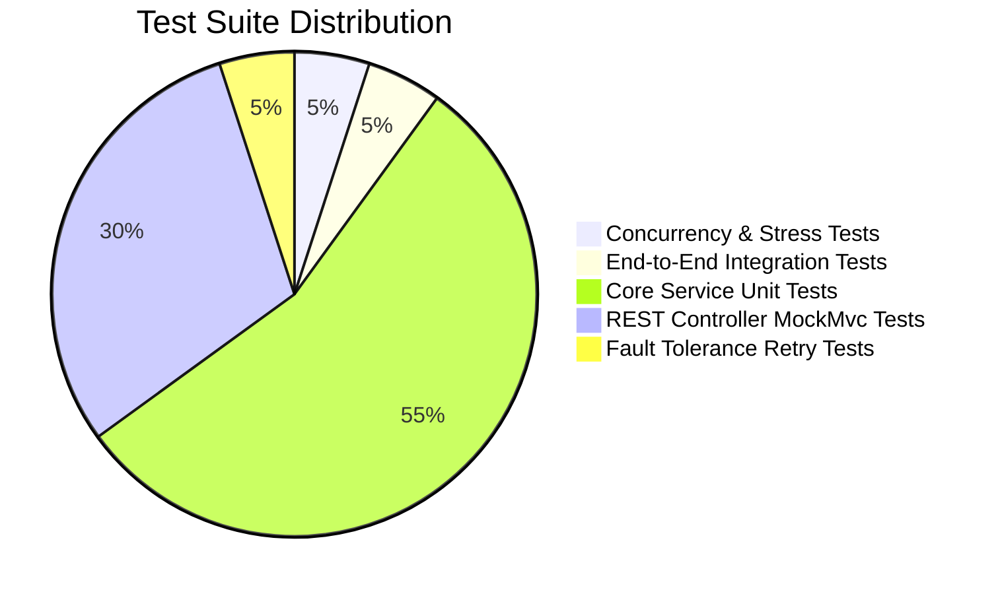

# Test Strategy & Verification Evidence

**System**: Distributed Fault-Tolerant Payment System  
**Test Suite**: JUnit 5 + Mockito + Spring Boot Test + MockMvc  
**Execution Status**: **20 Tests Passing (100% Success Rate)**  
**Target Role**: Standard Chartered Development Engineer (Band 8)  

---

## 1. Testing Philosophy & Pyramid

Financial systems require uncompromising verification standards. Our testing methodology emphasizes high-concurrency invariants, boundary state transitions, and fault tolerance recovery:

---

## 2. Test Execution Summary

Running `mvn clean test` across the complete project produces:

- **Total Tests Executed**: 20
- **Passed**: 20
- **Failures**: 0
- **Errors**: 0
- **Skipped**: 0
- **Build Status**: **BUILD SUCCESS**

---

## 3. Test Suites & Coverage Breakdown

| Test Suite Class | Type | Tests | Key Capabilities Verified |
| :--- | :--- | :-: | :--- |
| `ConcurrentPaymentTest` | Multi-Threaded Stress | 1 | 10 parallel threads submitting identical idempotency keys; verifies single execution, 9 lock conflicts caught, and zero double-spending. |
| `FaultToleranceRetryTest` | Fault Simulation | 1 | Injected gateway socket read timeouts; validates exponential backoff with jitter and successful recovery on subsequent attempt. |
| `IdempotencyServiceTest` | Unit / Mockito | 4 | 1. New key acquisition lock. 2. Concurrent in-progress request conflict. 3. Cached response return on identical replay. 4. Reused key with payload mismatch rejection (`PayloadMismatchException`). |
| `PaymentProcessingServiceTest` | Unit / Mockito | 3 | 1. Sufficient balance payment authorization. 2. Insufficient balance fail-fast check (`InsufficientBalanceException` with 0 retries). 3. Collection pagination (`page`, `size`). |
| `RefundProcessingServiceTest` | Unit / Mockito | 4 | 1. Valid partial refund and balance restoration. 2. Rejection of refund on FAILED payments. 3. Prevention of cumulative refunds exceeding transaction amount. 4. Cached response on duplicate refund idempotency key. |
| `PaymentControllerTest` | Spring MVC MockMvc | 3 | 1. `POST /api/v1/payments` returns 201 CREATED for sync payment. 2. Returns 409 CONFLICT on payload mismatch. 3. Supports pagination parameters (`page`, `size`). |
| `RefundControllerTest` | Spring MVC MockMvc | 3 | 1. `POST /api/v1/refunds` returns 201 CREATED. 2. Returns 422 UNPROCESSABLE_ENTITY on invalid state transition. 3. `GET /api/v1/refunds/{id}` returns 200 OK. |
| `PaymentLifecycleIntegrationTest` | E2E Integration | 1 | Complete banking lifecycle: User creation -> Sync payment -> Idempotent replay -> Payload mismatch -> Input validation -> Payment retrieval -> Valid refund -> Over-refund rejection -> Audit trail verification. |

---

## 4. Key Verified Invariants

### 4.1 Zero Double-Spending Under 10 Parallel Threads
`ConcurrentPaymentTest` launches 10 concurrent threads against a single user account ($1,000 balance).
- **Result**: Exactly 1 thread successfully acquired the atomic lock and processed the transaction.
- **Result**: 9 threads encountered managed concurrency lock conflicts and were gracefully rejected without executing side effects.
- **Final Balance**: Exactly $900.00 (deducted exactly once).

### 4.2 Fail-Fast Non-Retryable Error Handling
`PaymentProcessingServiceTest.testInitiatePayment_InsufficientBalance` validates that business errors do not waste retries.
- **Attempt Count**: Exactly 1 attempt.
- **Retry Count Recorded**: 0 retries.
- **Verification**: `verify(metricsService, never()).recordRetry()`.

### 4.3 Payload Mismatch Conflict Detection
`IdempotencyServiceTest.testTryAcquire_PayloadMismatch_ThrowsException` and `PaymentControllerTest.testInitiatePayment_PayloadMismatch_ReturnsConflict` verify that re-using an idempotency key with a different payload throws `PayloadMismatchException` and yields HTTP 409 Conflict.
