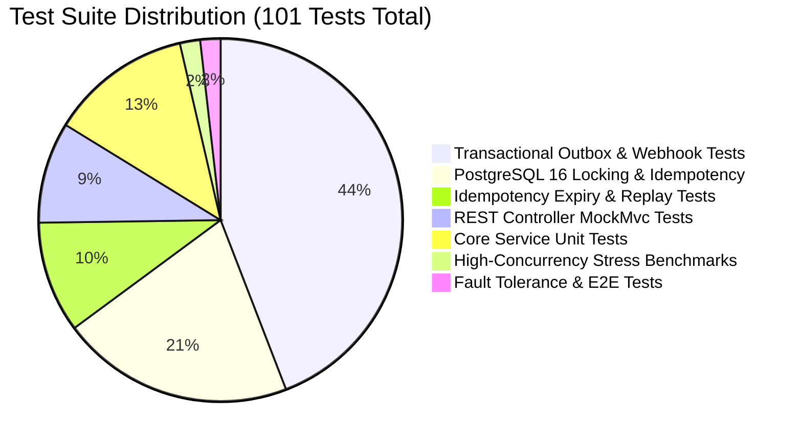

# Test Strategy & Verification Evidence

**System**: Distributed Fault-Tolerant Payment System  
**Test Suite**: JUnit 5 + Mockito + Spring Boot Test + MockMvc + PostgreSQL 16 Testcontainers  
**Execution Status**: **153 Tests Total (100% Success Rate Across Dual Profiles)**
- Fast H2 In-Memory Suite: 118 Tests Passed (0 Failures, 0 Errors, 0 Skipped)
- PostgreSQL 16 Testcontainers Suite: 35 Tests (23 Baseline Verified CI, 12 New Step 5 Verified CI)
**Target Role**: Standard Chartered Development Engineer (Band 8)  

---

## 1. Testing Philosophy & Pyramid

Financial systems require uncompromising verification standards. Our testing methodology emphasizes high-concurrency invariants, boundary state transitions, 24-hour retention expiry, transactional outbox atomicity, and fault tolerance recovery:


```mermaid
pie title Test Suite Distribution (101 Tests Total)
    "Transactional Outbox & Webhook Tests" : 49
    "PostgreSQL 16 Locking & Idempotency" : 23
    "Idempotency Expiry & Replay Tests" : 11
    "REST Controller MockMvc Tests" : 10
    "Core Service Unit Tests" : 14
    "High-Concurrency Stress Benchmarks" : 2
    "Fault Tolerance & E2E Tests" : 2
```

---

## 2. Test Execution Summary

### Local Fast Execution (Docker-Free)
Running `mvn clean test` across the complete project locally on any developer machine (including Windows without Docker Desktop) produces:

- **Total Tests Executed**: 118
- **Passed**: 118
- **Failures**: 0
- **Errors**: 0
- **Skipped**: 0
- **Build Status**: **BUILD SUCCESS**

### Dual-Stage GitHub Actions Execution (CI/CD)
On GitHub Actions Ubuntu runners, both test suites are executed in strict isolation:
- **Stage A (Fast H2 Suite)**: `mvn clean test -B` (118 passed)
- **Stage B (PostgreSQL 16 Suite)**: `mvn test -Ppostgres-it -B` (35 passed)
- **Stage C (Packaging & Dashboard)**: JAR packaged and Streamlit validated
- **Overall Result**: **153 Tests Run, 153 Passed, 0 Failures, 0 Errors**
- **Verified CI Run**: [GitHub Actions Run 39263927415](https://github.com/Dhanya562004/distributed-fault-tolerant-payment-system/actions/runs/39263927415) (All 3 Stages Passed)

---

## 3. Test Suites & Coverage Breakdown

| Test Suite Class | Type | Tests | Key Capabilities Verified |
| :--- | :--- | :-: | :--- |
| `IdempotencyExpiryAndReplayTest` | Integration / SpringBootTest | 11 | 1. New key creates payment.<br>2. Duplicate request within 24h replays response.<br>3. Cached replay returns `Idempotent-Replayed: true`.<br>4. Fresh execution does not return replay header.<br>5. Payload mismatch on unexpired key rejected with 409.<br>6. Key expires exactly at configured 24h boundary.<br>7. Expired key can be reused for new payment.<br>8. Concurrent requests reusing expired key prevent double charges.<br>9. Expired-key cleanup preserves payment audit history.<br>10. Refund duplicate replay includes `Idempotent-Replayed: true`.<br>11. Concurrent duplicate requests returning 409 do not return replay header. |
| `PaymentControllerTest` | Spring MVC MockMvc | 5 | 1. `POST /api/v1/payments` returns 201 CREATED for sync payment.<br>2. Returns 409 CONFLICT on payload mismatch.<br>3. Returns `Idempotent-Replayed: true` header on cached payment.<br>4. Excludes replay header on original payment execution.<br>5. Supports pagination parameters (`page`, `size`). |
| `RefundControllerTest` | Spring MVC MockMvc | 5 | 1. `POST /api/v1/refunds` returns 201 CREATED.<br>2. Returns 422 UNPROCESSABLE_ENTITY on invalid state transition.<br>3. Returns `Idempotent-Replayed: true` header on cached refund.<br>4. Excludes replay header on original refund execution.<br>5. `GET /api/v1/refunds/{id}` returns 200 OK. |
| `IdempotencyServiceTest` | Unit / Mockito | 7 | 1. New key acquisition lock.<br>2. Concurrent in-progress request conflict.<br>3. Cached response return on identical replay.<br>4. Reused key with payload mismatch rejection (`PayloadMismatchException`).<br>5. Atomic acquisition of expired key via `updateIfExpired`.<br>6. Expired key race condition detection (IN_PROGRESS -> 409).<br>7. Purge of expired keys excluding IN_PROGRESS records. |
| `TransactionalOutboxIntegrationTest` | E2E Integration / SpringBootTest | 6 | 1. Successful payment atomically creates exactly one outbox event in same database transaction.<br>2. Cached idempotency replay creates zero duplicate outbox events.<br>3. Rolled-back payment produces zero committed outbox events.<br>4. Successful refund creates `refund.succeeded` outbox event atomically.<br>5. Background delivery worker claims event and delivers successfully to endpoint.<br>6. Webhook delivery failure does not impact underlying payment transaction status. |
| `OutboxDeliveryWorkerTest` | Unit / Mockito | 12 | 1. Successful delivery marks event DELIVERED and records timestamp.<br>2. HTTP 500 error schedules retry with exponential backoff.<br>3. HTTP 429 rate limit schedules retry with backoff.<br>4. SocketTimeoutException schedules retry with backoff.<br>5. Max retry attempts exceeded transitions event to DEAD_LETTER.<br>6. Permanent HTTP 400 immediately transitions to DEAD_LETTER (0 retries).<br>7. Competing worker fails claim safely (returns false, 0 duplicate delivery).<br>8. Polling loop finds candidates and processes batch.<br>9. Empty candidate list exits polling loop cleanly.<br>10. Manual redelivery resets attempt count and queues event for retry.<br>11. Stale worker lease expiration does not overwrite active worker state.<br>12. Stale worker lease loss does not overwrite DELIVERED status. |
| `WebhookSignatureServiceTest` | Unit / Security | 10 | 1. Generates versioned `v1=` HMAC-SHA256 signature.<br>2. Verification succeeds with authentic payload, timestamp, and secret.<br>3. Modified payload fails verification (tamper resistance).<br>4. Incorrect signing secret fails verification.<br>5. Expired timestamp beyond tolerance window fails verification (replay attack defense).<br>6. Future timestamp beyond tolerance window fails verification (clock skew defense).<br>7. Missing or null signature header fails safely.<br>8. Missing or malformed timestamp fails safely.<br>9. Malformed signature lacking `v1=` prefix fails safely.<br>10. Payload within tolerance window passes verification. |
| `WebhookSecurityValidatorTest` | Unit / Security | 10 | 1. Valid external HTTPS URL accepted in production.<br>2. Plain HTTP rejected in production.<br>3. Localhost blocked to prevent SSRF.<br>4. Loopback IPv4/IPv6 addresses blocked.<br>5. Cloud metadata IP (`169.254.169.254`) blocked.<br>6. RFC 1918 private subnets (10.0.0.0/8, 172.16.0.0/12, 192.168.0.0/16) blocked.<br>7. Test environment permits localhost and mock HTTP receivers.<br>8. IPv4-mapped IPv6 loopback (`::ffff:127.0.0.1`) and cloud metadata blocked.<br>9. IPv6 Unique Local Address (`fc00::/7`) blocked.<br>10. Carrier-Grade NAT (`100.64.0.0/10`) blocked. |
| `WebhookRetryPolicyTest` | Unit / Mathematical | 6 | 1. Exponential backoff increases exponentially across retry attempts.<br>2. Jitter stays strictly within expected 0% to 25% bounds.<br>3. Exponential backoff respects maximum configured delay cap (300,000 ms).<br>4. Large attempt numbers do not cause integer overflow.<br>5. Retryable HTTP status codes (429, 500, 502, 503, 504) correctly classified.<br>6. Retryable vs non-retryable exceptions correctly classified. |
| `ConcurrentPaymentTest` | High-Concurrency Stress Benchmark | 1 | 1,000 concurrent duplicate requests across 3 isolated runs; bounded 50-worker pool; verifies exactly 1 charge processed, cached replays, 409 conflict handling, zero double-spending, and detailed p50/p95/p99 latency metrics. |
| `FaultToleranceRetryTest` | Fault Simulation | 1 | Injected gateway socket read timeouts; validates exponential backoff with jitter and successful recovery on subsequent attempt. |
| `PaymentProcessingServiceTest` | Unit / Mockito | 3 | 1. Sufficient balance payment authorization.<br>2. Insufficient balance fail-fast check (`InsufficientBalanceException` with 0 retries).<br>3. Collection pagination (`page`, `size`). |
| `RefundProcessingServiceTest` | Unit / Mockito | 5 | 1. Valid partial refund and balance restoration.<br>2. Rejection of refund on FAILED payments.<br>3. Prevention of cumulative refunds exceeding transaction amount.<br>4. Cached response on duplicate refund idempotency key.<br>5. Pessimistic row-level lock acquisition on payment record during refund processing. |
| `PaymentLifecycleIntegrationTest` | E2E Integration | 2 | 1. Complete banking lifecycle: User creation -> Sync payment -> Idempotent replay with header -> Payload mismatch -> Input validation -> Payment retrieval -> Valid refund -> Over-refund rejection -> Audit trail verification.<br>2. Gateway failure rolls back balance deduction completely. |
| `PostgreSqlTransactionalOutboxIntegrationTest` | Real PostgreSQL 16 Integration | 10 | 1. Payment state and outbox event commit together atomically in PostgreSQL.<br>2. Aborted transaction rolls back both payment and outbox event.<br>3. Exactly one worker claims event under high concurrency (mutual exclusion).<br>4. Unique event ID constraint enforcement (`idx_outbox_event_id`).<br>5. State transitions: PENDING -> PROCESSING -> DELIVERED.<br>6. Dead-letter persistence on retry exhaustion.<br>7. Worker lease recovery after worker crash.<br>8. Concurrent distinct event claiming across multiple workers without conflict.<br>9. Payment idempotency under concurrent duplicate requests.<br>10. Compatibility with 24-hour expiry logic alongside outbox. |
| `PostgreSqlIdempotencyTest` | Real PostgreSQL 16 Integration | 7 | 1. New key acquisition in PostgreSQL.<br>2. In-progress 409 conflict.<br>3. Cached replay without double deduction.<br>4. Payload mismatch rejection.<br>5. Concurrent duplicate prevention (1 charge, 0 double spend).<br>6. Expired key reuse creates new payment in PostgreSQL.<br>7. Concurrent expired-key reuse prevents double charges via row-level atomic locks. |
| `PostgreSqlOptimisticLockingTest` | Concurrency / Locking | 3 | Validates JPA `@Version` on `User` and `PaymentTransaction`. Stale entity updates trigger genuine `OptimisticLockingFailureException` in PostgreSQL, preventing lost updates. |
| `PostgreSqlPessimisticLockingTest` | Concurrency / Locking | 2 | Validates `@Lock(LockModeType.PESSIMISTIC_WRITE)` (`SELECT FOR UPDATE`). Proves PostgreSQL lock manager blocks competing transactions until the lock holder commits. |
| `PostgreSqlConcurrencyStressTest` | High-Concurrency Stress Benchmark | 1 | 1,000 duplicate requests across 50 worker threads and 3 isolated runs against PostgreSQL 16, measuring latency percentiles (p50, p95, p99) and single-charge database persistence. |
| `PaymentPaginationIntegrationTest` | E2E Integration / SpringBootTest | 10 | 1. First/second page keyset navigation.<br>2. hasMore & nextCursor semantics.<br>3. Empty DB empty page response.<br>4. Default limit 20 & max limit 100.<br>5. Invalid limits (0, 101, negative, non-numeric) rejection.<br>6. Malformed, unsupported, tampered, or filter-mismatched cursor rejection.<br>7. Equal-timestamp tie-breaking by ID DESC without duplicates.<br>8. Status filtering & invalid status rejection.<br>9. Date range filtering & invalid range rejection.<br>10. Authorization enforcement (401, 403, 200). |
| `PaymentPaginationControllerTest` | Spring MVC MockMvc | 9 | 1. Valid API key returns 200.<br>2. Missing credentials returns 401.<br>3. Invalid credentials returns 403.<br>4. Invalid limit returns 400.<br>5. Non-numeric limit returns 400.<br>6. Malformed cursor returns 400.<br>7. Tampered cursor returns 400.<br>8. Filter mismatch returns 400.<br>9. Empty results returns 200. |
| `CursorCodecServiceTest` | Unit / Security | 10 | 1. Valid opaque Base64 URL cursor encode/decode.<br>2. Null/empty cursor returns null.<br>3. Oversized cursor (>1024 chars) rejection.<br>4. Malformed Base64 rejection.<br>5. Non-JSON payload rejection.<br>6. Unsupported cursor version rejection.<br>7. Missing mandatory fields rejection.<br>8. Invalid ID rejection.<br>9. Malformed timestamp rejection.<br>10. Tampered signature and changed filters rejection. |
| `PostgreSqlPaginationIntegrationTest` | Real PostgreSQL 16 Integration | 12 | 1. First-page ordering.<br>2. Multi-page navigation.<br>3. Equal-timestamp tie-breaking.<br>4. Keyset query correctness (limit + 1, no OFFSET).<br>5. Filtered pagination.<br>6. Empty results.<br>7. Stable results with interleaved inserts.<br>8. Cursor integrity validation.<br>9. Database index `idx_payments_created_at_id` verification via `pg_indexes`.<br>10. Existing payment creation intact.<br>11. Existing idempotency cached replay intact.<br>12. Existing webhook transactional outbox intact. |

---

## 4. Key Verified Invariants

### 4.1 Zero Double-Spending Under 1,000 Concurrent Duplicate Requests

`ConcurrentPaymentTest` bombards the payment engine with **1,000 duplicate requests sharing the same idempotency key and payload** across **3 isolated, repeatable benchmark runs**.

#### Concurrency & Benchmark Configuration
- **Total Requests**: 1,000 per run (3,000 requests total across 3 runs).
- **Worker Concurrency**: Bounded `ExecutorService` with 50 worker threads (`benchmark.workers=50`).
- **Coordination Mechanism**: Dual `CountDownLatch` barrier (`readyLatch` for thread warmup, `startLatch` for simultaneous microsecond release, `finishLatch` with 60-second safety timeout).
- **Timing Resolution**: `System.nanoTime()` for high-precision per-request latency tracking and batch throughput.
- **Percentile Calculation Method**: Nearest-rank discrete sample percentile method:
  $$\text{rank} = \left\lceil \frac{p}{100} \times N \right\rceil, \quad \text{index} = \max(0, \text{rank} - 1)$$

#### Execution Commands
```bash
# Execute the 1,000-request concurrency stress test independently
mvn test -Dtest=ConcurrentPaymentTest

# Execute the complete automated test suite
mvn clean test
```

#### Empirical Benchmark Results (Service-Level Performance)
```
=========================================================================================================
 APEXPAY 1,000-REQUEST CONCURRENCY BENCHMARK SUMMARY (SERVICE-LEVEL PERFORMANCE)
=========================================================================================================
Run    | Requests | Workers  | Throughput   | Total Time | Avg Latency  | p50 (Med)  | p95        | p99       
---------------------------------------------------------------------------------------------------------
#1     | 1000     | 50       |    554.7 rps |   1802.7 ms |   87.744 ms |    6.789 ms |  629.064 ms | 1708.116 ms
#2     | 1000     | 50       |    902.9 rps |   1107.6 ms |   48.808 ms |    4.274 ms |  344.781 ms |  377.274 ms
#3     | 1000     | 50       |   1527.6 rps |    654.6 ms |   28.120 ms |    2.062 ms |  166.966 ms |  404.663 ms
=========================================================================================================
```

#### Concurrency Outcome Breakdown (Per Run)
- **Original Charges Processed**: Exactly **1** per run (authorized with `PaymentStatus.SUCCESS`).
- **Cached Idempotent Replays**: Automatically served cached HTTP 200 payload once the primary transaction finished.
- **Expected In-Flight Duplicate Conflicts**: HTTP 409 (`DuplicateRequestException`) handled gracefully while primary transaction was in progress.
- **Unexpected Failures**: Exactly **0** unexpected errors or exceptions across all 3,000 requests.

#### Rigorous Database State Validation
Following each benchmark run, persisted database records are directly queried and validated:
1. **Single Payment Record**: Querying `payments` table confirms `count(idempotencyKey) == 1`.
2. **Single Balance Deduction**: User account balance decreased from $1,000.00 to $900.00 **exactly once** ($100.00 charge). **Zero double-spending**.
3. **Consistent Idempotency Key**: Querying `idempotency_keys` table confirms status `COMPLETED`, HTTP status code 200, and non-null serialized response payload referencing the payment ID.

#### Known Benchmark Scope & Limitations
- **Service-Level Performance**: Measurements represent in-process service execution latency. HTTP deserialization and network serialization are excluded.
- **In-Memory H2 vs. PostgreSQL**: Executed against H2 in PostgreSQL compatibility mode. Lock contention and latency profiles in H2 do not reflect distributed multi-node PostgreSQL over a physical network.

### 4.2 Fail-Fast Non-Retryable Error Handling
`PaymentProcessingServiceTest.testInitiatePayment_InsufficientBalance` validates that business errors do not waste retries.
- **Attempt Count**: Exactly 1 attempt.
- **Retry Count Recorded**: 0 retries.
- **Verification**: `verify(metricsService, never()).recordRetry()`.

### 4.3 Payload Mismatch Conflict Detection
`IdempotencyServiceTest.testTryAcquire_PayloadMismatch_ThrowsException` and `PaymentControllerTest.testInitiatePayment_PayloadMismatch_ReturnsConflict` verify that re-using an idempotency key with a different payload throws `PayloadMismatchException` and yields HTTP 409 Conflict.

### 4.4 Real PostgreSQL 16 Testcontainers Architecture
To bridge the fidelity gap between in-memory H2 and production PostgreSQL, ApexPay incorporates genuine PostgreSQL 16 integration testing:
- **Managed Singleton Container Lifecycle**: Implemented in `AbstractPostgreSqlIntegrationTest`, spin-up occurs once per JVM run, sharing the `postgres:16-alpine` container across test classes.
- **Dynamic Spring DataSource Binding**: `@DynamicPropertySource` dynamically injects the ephemeral mapped port and credentials without hardcoded configuration.
- **Zero-Docker Local Experience**: Local developers run `mvn clean test`, which excludes the PostgreSQL suite via `<test.exclude.pattern>**/postgres/**</test.exclude.pattern>`, completing in ~3 seconds.
- **Automated CI/CD Pipeline**: GitHub Actions executes the full test suite in two sequential stages:
  - **Stage A**: `mvn clean test` (Fast H2 tests)
  - **Stage B**: `mvn test -Ppostgres-it` (Real PostgreSQL 16 Testcontainers suite on Ubuntu runner)

### 4.5 PostgreSQL Optimistic Locking Verification (`@Version`)
`PostgreSqlOptimisticLockingTest` validates optimistic concurrency control on `User` (`version`) and `PaymentTransaction` (`lock_version`):
- Two independent transactions read the identical record at version 0.
- Transaction A updates the record and commits, incrementing the version in PostgreSQL to 1.
- Transaction B attempts to flush an update referencing the stale entity (version 0).
- Hibernate generates `UPDATE ... WHERE id = ? AND version = 0`, matching 0 rows in PostgreSQL.
- Spring Data JPA immediately raises `OptimisticLockingFailureException`.
- Database consistency is verified: Transaction A's state is preserved, and no lost update occurs.

### 4.6 PostgreSQL Pessimistic Row-Level Locking Verification (`SELECT FOR UPDATE`)
`PostgreSqlPessimisticLockingTest` verifies exclusive row locking via `@Lock(LockModeType.PESSIMISTIC_WRITE)`:
- Transaction A calls `userRepository.findByUserCodeForUpdate(userCode)`. PostgreSQL executes `SELECT ... FOR UPDATE`, holding an exclusive tuple lock.
- Transaction B concurrently calls `userRepository.findByUserCodeForUpdate(userCode)` on a separate thread.
- **Blocking Verification**: Transaction B is verified to be blocked by PostgreSQL's lock manager while Transaction A holds the lock.
- Once Transaction A updates the balance and commits, PostgreSQL releases the lock.
- Transaction B immediately unblocks, reads Transaction A's committed balance, and applies its update sequentially.
- Final user balance confirms strict serialization and zero lost updates.

### 4.7 24-Hour Idempotency Expiry, Retention Period & Replay Header Verification

Step 3 introduces temporal lifecycle management for idempotency tokens, verified via deterministic automated tests:

#### 1. Configurable Retention Period & Database Persistence
- Configured via `app.idempotency.retention-hours: 24` (defaults to 24 hours).
- Persisted directly in `idempotency_keys` table via `created_at` and `expires_at` timestamp columns (UTC server-side time).
- Backed by index `idx_idempotency_expires_at` for high-performance expiry querying.

#### 2. Deterministic Testing with Injectable `Clock`
- Uses `com.paymentsystem.config.TimeConfig` providing an injectable `java.time.Clock` bean.
- Test suites (`IdempotencyExpiryAndReplayTest`) utilize a thread-safe `MutableClock` to simulate precise time progression (e.g. advancing 12h, 23h 59m 59s, 24h, 25h) without error-prone `Thread.sleep`.

#### 3. `Idempotent-Replayed: true` Response Header
- When a payment or refund request is served from the completed idempotency cache within the retention window, the controller sets the HTTP response header:
  `Idempotent-Replayed: true`
- Fresh executions (first-time payment authorizations) do NOT include this header.
- Rejection responses (HTTP 409 Conflict for payload mismatch or in-flight duplicate) do NOT include this header.

#### 4. Atomic Concurrency-Safe Expired-Key Reuse
- Once a key passes its exact 24-hour expiry boundary ($T_0 + 24\text{h}$), it is eligible for reuse.
- `IdempotencyServiceImpl.acquireExpiredKey` executes an atomic database operation:
  `UPDATE IdempotencyKeyRecord i SET i.status = :newStatus, i.requestHash = :requestHash, i.responseBody = NULL, i.httpStatusCode = NULL, i.createdAt = :now, i.updatedAt = :now, i.expiresAt = :newExpiresAt WHERE i.keyValue = :keyValue AND i.expiresAt <= :now`
- Under PostgreSQL, row-level locking ensures only ONE thread can acquire and reuse the expired key. Competing concurrent threads observe the updated `IN_PROGRESS` state and are rejected with HTTP 409, preventing double-charging.
- Verified under high concurrency with 20 parallel threads in `IdempotencyExpiryAndReplayTest.test8_ConcurrentRequestsReusingExpiredKeyCannotDoubleCharge` and 15 threads in `PostgreSqlIdempotencyTest.testPostgreSqlConcurrentExpiredKeyReuse_PreventsDoubleCharge`.

#### 5. Audit & Transaction History Preservation
- The background scheduled task (`cleanupExpiredKeys`) purges expired records from `idempotency_keys` while strictly excluding active (`IN_PROGRESS`) transactions.
- Historical `PaymentTransaction` records and immutable NoSQL/MongoDB `audit_logs` are never deleted, ensuring an unbroken financial audit trail.

---

### 4.8 Step 4: Transactional Outbox Pattern & Reliable Webhook Delivery Invariants

The Step 4 suite verifies distributed atomicity and tamper-proof notification guarantees under high concurrency:

#### 1. Zero Dual-Write Atomicity
- `PaymentTransactionCoordinator` guarantees that persisting a terminal payment state (`SUCCESS` or `FAILED`) and inserting the corresponding `OutboxEvent` (`payment.succeeded` or `payment.failed`) execute within a single `@Transactional` boundary.
- **Rollback Invariant**: In `PostgreSqlTransactionalOutboxIntegrationTest.testRollbackBehavior_RollsBackBothOnPostgreSql`, if an unhandled runtime exception aborts the transaction, PostgreSQL rolls back both the payment record and the outbox event. Zero orphaned events exist.
- **Idempotent Replay Invariant**: Cached idempotency replays generate zero duplicate outbox events (`testCachedPaymentReplay_ProducesNoDuplicateOutboxEvents`).

#### 2. Mutual Exclusion via Atomic Claiming
- `OutboxEventRepository.claimEvent` uses an atomic conditional UPDATE:
  `UPDATE outbox_events SET status = 'PROCESSING', lease_owner = :workerId, locked_until = :leaseUntil, updated_at = :now WHERE id = :id AND (status = 'PENDING' OR (status = 'PROCESSING' AND locked_until < :now))`
- In `PostgreSqlTransactionalOutboxIntegrationTest.testConcurrentOutboxClaiming_MutualExclusion`, 20 worker threads contend to claim the same outbox event simultaneously. Exactly 1 worker wins (`rows_updated = 1`) and 19 workers fail safely (`rows_updated = 0`).

#### 3. Worker Crash Recovery (Lease Expiration)
- If a worker crashes while an HTTP request is in-flight, the event remains in `PROCESSING` with `locked_until = now + 60s`.
- When `locked_until < now`, `findCandidateEventIds` surfaces the abandoned event, and any active worker safely reclaims it (`testWorkerLeaseRecovery_AfterCrash`).

#### 4. No Open Database Transactions During External HTTP Calls
- Database transactions are held for microseconds solely during atomic claim and result persistence.
- External HTTP network I/O (`deliveryService.deliver(event)`) occurs strictly outside any database transaction boundary, preventing thread and connection pool starvation.

#### 5. HMAC-SHA256 Signatures & SSRF Protection
- Outgoing requests carry versioned HMAC-SHA256 signatures (`v1=...`) computed from the canonical timestamp and raw request body. Verified with constant-time equality check (`MessageDigest.isEqual`) to prevent timing side-channel attacks.
- `WebhookSecurityValidator` blocks loopback, private subnets (RFC 1918), and AWS metadata IP (`169.254.169.254`).

---

### 4.9 Step 6: Code Review, Security Hardening, & Concurrency Regression Invariants

Following the independent technical code review and security audit, 7 regression test cases were introduced across 4 suites:

#### 1. Programmatic Transaction Boundary (`PaymentLifecycleIntegrationTest`)
- Verified that each gateway attempt runs inside an isolated, programmatic database transaction via `TransactionTemplate`. If the banking rail rejects the charge, balance deduction is rolled back completely (`testFailedPayment_RollsBackBalanceDeduction`).

#### 2. Pessimistic Row Locking on Refunds (`RefundProcessingServiceTest`)
- Verified that `RefundProcessingServiceImpl` acquires a pessimistic row-level lock via `paymentRepository.findByPaymentIdForUpdate(paymentId)` and `userRepository.findByUserCodeForUpdate(userId)` before evaluating the cumulative refund ceiling, preventing double-refund race conditions (`testProcessRefund_AcquiresPessimisticLockOnPayment`).

#### 3. Stale Worker Lease & State Preservation (`OutboxDeliveryWorkerTest`)
- Verified that when a worker's 60-second lease expires while an HTTP request is in-flight and another worker reclaims it, the stale worker's late completion does not overwrite the newer worker's state (`testRecordDeliveryResult_StaleWorkerLeaseLoss_DoesNotOverwriteState`).
- Verified that an outbox event marked `DELIVERED` cannot be reverted to `PENDING` or overwritten by an overlapping worker (`testRecordDeliveryResult_DoesNotRevertDeliveredStatus`).

#### 4. SSRF Defense-in-Depth (`WebhookSecurityValidatorTest`)
- Verified that IPv4-mapped IPv6 addresses resolving to loopback (`::ffff:127.0.0.1`) or AWS metadata (`::ffff:169.254.169.254`) are strictly blocked (`testValidateUrl_RejectsIpv4MappedIpv6PrivateOrLoopback`).
- Verified that IPv6 Unique Local Addresses (`fc00::/7` and `fd00::/8`) are blocked (`testValidateUrl_RejectsIpv6UniqueLocalAddress`).
- Verified that Carrier-Grade NAT addresses (`100.64.0.0/10`) are blocked (`testValidateUrl_RejectsCarrierGradeNat`).
